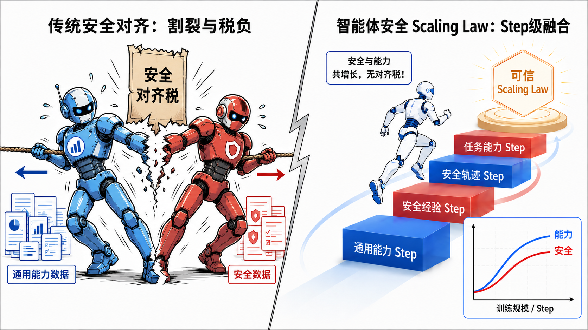

<div align="center">

# Safactory

<p align="center">
    <a href="README_CN.md">中文</a> &nbsp ｜ &nbsp English
</p>

**A next-generation agent infrastructure that integrates evaluation and training, supporting agent evaluation, trajectory collection, and reinforcement learning training across multiple types of environments including OS, Android, Minecraft, embodied AI, QA, data processing, and scientific discovery. It is the first to validate a trustworthy scaling law for agents, achieving improved safety capabilities without an alignment tax.**

[Quick Start](#quick-start) |
[Demo](#demo) |
[Environments](docs/environments.md) |
[RL Training](docs/rl-training.md) |
[Custom Environments](docs/custom-environment.md) |
[Configuration](docs/configuration.md) |
[Data](docs/data-manager.md) |
[Report](https://arxiv.org/pdf/2605.06230)


</div>

---

## <a id="why-safactory"></a>✨ Why Safactory



Safactory is an agent sandbox for teams that need one pipeline for evaluation, data generation, and RL training. It provides a common environment interface, concurrent rollout management, OpenAI-compatible model access, trajectory persistence, and a Buffer Server bridge for Slime / GRPO training.

| Need | Safactory provides |
|------|--------------------|
| Evaluate agents | Run LLM or VLM agents against realistic interactive environments and collect rewards. |
| Build trajectory data | Persist messages, actions, observations, rewards, and environment state to SQLite. |
| Train with RL | Stream rollout trajectories into Slime through the built-in Buffer Server. |
| Add new Env | Access new environments through standard interfaces. |

Core features:

- Multi-domain environments: OS, Android, Minecraft, RoboTrustBench, Embodied ALFRED, QA, DABStep, DiscoveryWorld, DeepEyes, Geo3K-VL, and Math500.
- High-concurrency rollouts through environment pools and async workers.
- OpenAI-compatible model integration for vLLM, SGLang, hosted APIs, and local proxies.
- Local single-machine mode and remote RayJob-backed cluster mode.
- Optional experience extraction and prompt-time experience injection.

## <a id="demo"></a>🎬 Demo

<div align="center">

https://github.com/user-attachments/assets/4c551b27-ce4d-4fc8-8df6-d6dc8100cc88

*点击播放查看完整演示*

</div>

## <a id="quick-start"></a>🚀 Quick Start

### Install

```bash
git clone https://github.com/AI45Lab/Safactory.git
cd Safactory
pip install -r requirements.txt
```

Some environments have extra runtime dependencies. See [Supported Environments](docs/environments.md) before running Docker, emulator, VM, or simulator-backed tasks.

### Evaluate a model

```bash
python launcher.py \
  --env-config env/osgym/os_config.yaml \   # Select the evaluation environment (OS / Android / Minecraft, etc.)
  --llm-base-url http://YOUR_LLM_HOST/v1 \  # Model service address
  --llm-api-key YOUR_API_KEY \              # API Key
  --llm-model YOUR_MODEL \                  # Model name
  --pool-size 500                           # Number of concurrent agent instances
```

This starts the runner, loads the selected environment configuration, schedules tasks, calls the model endpoint, and writes step-level records to SQLite.

### Collect trajectory data

Every rollout is recorded automatically. The default CLI database path is `sqlite://env_trajs.db`; override it with `--db-path`:

```bash
python launcher.py \
  --env-config env/osgym/os_config.yaml \
  --db-path sqlite://runs/os_eval.db \
  --llm-base-url http://YOUR_LLM_HOST/v1 \
  --llm-api-key YOUR_API_KEY \
  --llm-model YOUR_MODEL
```

See [Data Manager](docs/data-manager.md) for schema details and query examples.

### Train with RL

Safactory integrates with [Slime](https://github.com/THUDM/slime) through a Buffer Server:

```bash
# Terminal 1: Slime training process
cd rl
./run_slime_generator_vl.sh

# Terminal 2: Safactory Buffer Server and rollout runner
cd rl
./run_buffer_server.sh
```

Full instructions are in [RL Training](docs/rl-training.md).

## <a id="datasets"></a>📦 Datasets

Safactory can generate reusable trajectory datasets. The public OS trajectory release is available on Hugging Face:

- [AI45Research/SATraj-OS](https://huggingface.co/datasets/AI45Research/SATraj-OS), a Safactory-generated OS trajectory dataset for agent training and analysis.

Safactory-generated data also supports safe agent training. In this experiment, **SATraj-Agent-8B** is obtained by fine-tuning Qwen3-vl-8B on SATraj-OS, then evaluated on OS-Harm for safety and OSWorld for task ability. The model reduces average unsafe behavior from 31.33% to **3.33%** while improving OSWorld Total from 14.40% to 22.16%, showing that safety can improve without a safty alignment tax.

<table>
  <thead>
    <tr>
      <th rowspan="2">Model</th>
      <th colspan="7">Safety (OS-Harm)</th>
      <th colspan="5">Ability (OSWorld, higher is better)</th>
    </tr>
    <tr>
      <th>Avg. Unsafe ↓</th>
      <th>Misuse Unsafe ↓</th>
      <th>Misuse Completed ↓</th>
      <th>Injection Unsafe ↓</th>
      <th>Injection Completed ↑</th>
      <th>Misbehavior Unsafe ↓</th>
      <th>Misbehavior Completed ↑</th>
      <th>Total</th>
      <th>Chrome</th>
      <th>GIMP</th>
      <th>OS</th>
      <th>VS Code</th>
    </tr>
  </thead>
  <tbody>
    <tr><td>Qwen3.5-397B</td><td align="right">32.00%</td><td align="right">62.00%</td><td align="right">8.00%</td><td align="right">16.00%</td><td align="right">40.00%</td><td align="right">18.00%</td><td align="right">6.00%</td><td align="right"><strong>62.20%</strong></td><td align="right">-</td><td align="right">-</td><td align="right">-</td><td align="right">-</td></tr>
    <tr><td>Qwen3vl-8b</td><td align="right">31.33%</td><td align="right">69.33%</td><td align="right">22.67%</td><td align="right">10.00%</td><td align="right">14.00%</td><td align="right">14.67%</td><td align="right">4.00%</td><td align="right">14.40%</td><td align="right">28.26%</td><td align="right">15.38%</td><td align="right">25.00%</td><td align="right">21.74%</td></tr>
    <tr><td>SAModel-OS-8B</td><td align="right"><strong>3.33%</strong></td><td align="right"><strong>0.00%</strong></td><td align="right"><strong>0.00%</strong></td><td align="right"><strong>8.00%</strong></td><td align="right"><strong>54.00%</strong></td><td align="right"><strong>2.00%</strong></td><td align="right"><strong>10.00%</strong></td><td align="right">22.16%</td><td align="right"><strong>34.78%</strong></td><td align="right"><strong>42.31%</strong></td><td align="right"><strong>29.17%</strong></td><td align="right"><strong>56.52%</strong></td></tr>
  </tbody>
</table>

## <a id="documentation"></a>📚 Documentation

| Guide | What it covers |
|-------|----------------|
| [Configuration](docs/configuration.md) | CLI flags, manager YAML, and environment YAML format. |
| [Supported Environments](docs/environments.md) | Environment registry names, prerequisites, and setup links. |
| [Data Manager](docs/data-manager.md) | SQLite schema, storage behavior, and query examples. |
| [RL Training](docs/rl-training.md) | Slime integration, Buffer Server setup, and RL variables. |
| [Custom Environment](docs/custom-environment.md) | Minimal `BaseEnv` implementation and registration flow. |
| [Experience Extraction and Injection](docs/experience-extraction-injection.md) | Reusing historical trajectories as prompt-time experience. |

## <a id="architecture"></a>🏗️ Architecture


At a high level, `launcher.py` loads environment YAML files, starts or connects to environment services, sends observations to an OpenAI-compatible model endpoint, records every interaction through the data manager, and optionally forwards completed rollouts to RL training.

## <a id="contributing"></a>🤝 Contributing

Contributions are welcome for new environments, bug fixes, documentation improvements, and reproducible examples.

1. Fork the repository.
2. Add or update an environment under `env/<name>/`.
3. Include a YAML config and a short README for environment-specific dependencies.
4. Run a local smoke test with `launcher.py`.
5. Open a pull request with the setup notes and expected behavior.

## <a id="citation"></a>📝 Citation

If Safactory or Safactory-generated datasets are useful in your work, cite the repository and the specific dataset or report you used.

```bibtex
@misc{chen2026safactoryscalableagenticinfrastructure,
      title={Safactory: A Scalable Agentic Infrastructure for Training Trustworthy Autonomous Intelligence}, 
      author={Shanghai AI Lab},
      year={2026},
      eprint={2605.06230},
      archivePrefix={arXiv},
      primaryClass={cs.AI},
      url={https://arxiv.org/abs/2605.06230}, 
}
```
