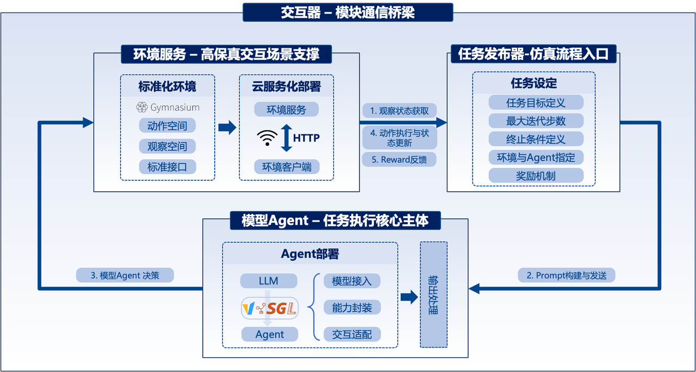

<div align="center">

<h1>🧪 Safactory</h1>

<p>
  <strong>A universal AI agent sandbox for evaluation, training data construction, and RL training<br>across ten open-source environments spanning Android, OS, Minecraft, Embodied agents, QA, data processing, scientific discovery, and multimodal reasoning.</strong>
</p>

<p>
  <a href="#-quick-start">Quick Start</a> •
  <a href="docs/environments.md">Environments</a> •
  <a href="docs/rl-training.md">RL Training</a> •
  <a href="docs/custom-environment.md">Custom Env</a> •
  <a href="docs/configuration.md">Configuration</a> •
  <a href="docs/data-manager.md">Data</a>
</p>

<p>
  
  
  
  
</p>

</div>

---

## 🎬 Demo

<p align="center">
  <video src="fig/demo_video.mp4" controls width="80%">
    <a href="fig/demo_video.mp4">
      
    </a>
  </video>
</p>

---

## ✨ Why Safactory?

Safactory provides a **unified pipeline** so you can go from model evaluation to RL training without changing your codebase:

| Goal | What Safactory does |
|------|---------------------|
| **Evaluate agents** | Run any LLM against realistic simulated environments and collect reward metrics |
| **Build training data** | Every interaction is automatically logged to SQLite — ready to be used as SFT / RL data |
| **RL training** | Feed rollout data directly into Slime-based GRPO training via the built-in Buffer Server |

Key strengths:

- 🌍 **Multi-domain environments** — Android, OS, Minecraft, RoboTrustBench, Embodied ALFRED and more
- ⚡ **High concurrency** — Environment pool management with async workers for fast parallel rollouts
- 🔌 **LLM-agnostic** — Works with any OpenAI-compatible endpoint (vLLM, SGLang, OpenAI API)
- 🏗️ **Two deployment modes** — `local` (single machine) or `remote` (Ray-based cluster)
- 🧩 **Extensible** — Add a new environment in < 50 lines by implementing a simple `BaseEnv` interface

---

## 🚀 Quick Start

### Installation

```bash
git clone https://gitee.pjlab.org.cn/L2/safeai/kilab/AISandbox.git
cd AIEvoBox
pip install -r requirements.txt
```

### 1 — Evaluate a Model

The example below evaluates a model on the **Android** environment (`android_gym`) in `local` mode.

> **Environment prerequisites (Android / host-native)**:
> - You have `adb` available on the host (or set `adb_path` in `env/androidgym/android_env.yaml`).
> - You have a local Android Emulator AVD available for `emulator_name` (default: `nexus_safe`), and `emulator_cmd_path` is `emulator`.
> - If you use `redroid`, ensure `nerdctl` is installed on the host (the environment will start a redroid container automatically).
> - The archive mirror includes the dataset file at `env/androidgym/cases.jsonl` (the repository does not ship datasets).

#### Step 1 — Prepare the Android environment

No separate Docker step is required for the default host-native workflow: `launcher.py` will start the emulator when `start_emulator: true`.

#### Step 2 — Run the evaluation

```bash
python launcher.py \
  --mode local \
  --env-config env/androidgym/android_env.yaml \
  --llm-base-url http://YOUR_LLM_HOST/v1 \
  --llm-api-key YOUR_LLM_API_KEY \
  --llm-model YOUR_MODEL_NAME \
  --pool-size 1
```

Results (reward per episode) are printed to the console and saved under a run-specific directory such as `logs/<run-id>/`.

### 2 — Collect Training Data

Every run automatically records step-level interactions (messages, response, reward, environment state) to `test_envs.db`. Records are available immediately after the run completes.

See [docs/data-manager.md](./docs/data-manager.md) for the database schema and example queries.

### 3 — RL Training (Optional)

With a rollout runner active, start the Slime training loop in a second terminal:

```bash
# Terminal 1 — Slime training process (requires Slime installation)
cd rl && ./run_slime_generator_vl.sh

# Terminal 2 — Buffer Server (launches the Safactory runner and collects rollouts)
cd rl && ./run_buffer_server.sh
```

> Terminals 1 and 2 can run on different machines as long as they can communicate.

Full setup guide: [docs/rl-training.md](./docs/rl-training.md)

### 4 — Experience Extraction & Injection（Optional）

Safactory supports optional experience extraction and injection. You can distill reusable lessons from historical trajectories into a local experience library, then inject relevant experience into the agent prompt at the start of a new episode.

For a detailed usage guide, see [docs/experience-extraction-injection.md](docs/experience-extraction-injection.md). 

---

## 📚 Documentation

| Guide | Description |
|-------|-------------|
| [Supported Environments](./docs/environments.md) | Setup, Prerequisites, Docker images, and Configuration|
| [RL Training](./docs/rl-training.md) | Slime integration, Buffer Server setup, and RL parameters |
| [Custom Environment](./docs/custom-environment.md) | Step-by-step guide to adding a new environment |
| [Configuration](./docs/configuration.md) | Full CLI reference and `config.yaml` schema |
| [Data Manager](./docs/data-manager.md) | Database schema and SQLite query examples |

---

## 🏗️ Architecture


---

## 🤝 Contributing

Contributions for new environments, bug fixes, and documentation improvements are welcome.

1. Fork the repository
2. Implement your environment under `env/your_env_name/`
3. Add a config YAML and a brief `README.md` in the same directory
4. Open a Pull Request

For questions and bug reports, please use the issue tracker.
