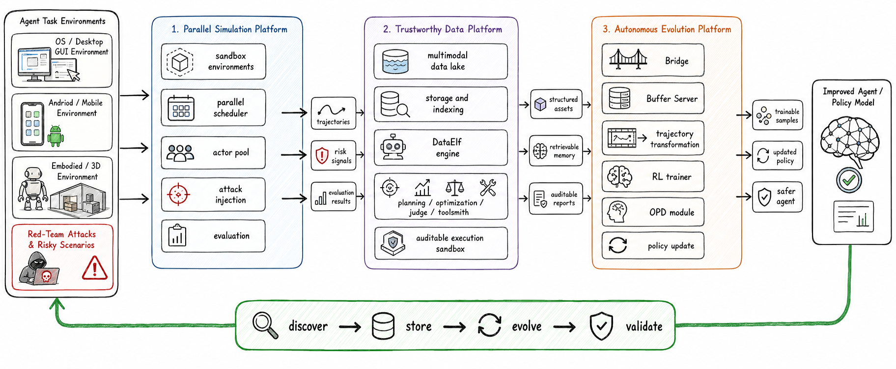

<div align="center">

# Safactory

**A universal sandbox for evaluating agents, collecting trajectories, and training with reinforcement learning across OS, Android, Minecraft, embodied, QA, data-processing, scientific-discovery, and multimodal environments.**

[Quick Start](#quick-start) |
[Demo](#demo) |
[Environments](docs/environments.md) |
[RL Training](docs/rl-training.md) |
[Custom Environments](docs/custom-environment.md) |
[Configuration](docs/configuration.md) |
[Data](docs/data-manager.md) |
[Report](report.pdf)


</div>

---

## Why Safactory

Safactory is an agent sandbox for teams that need one pipeline for evaluation, data generation, and RL training. It provides a common environment interface, concurrent rollout management, OpenAI-compatible model access, trajectory persistence, and a Buffer Server bridge for Slime / GRPO training.

| Need | Safactory provides |
|------|--------------------|
| Evaluate agents | Run LLM or VLM agents against realistic interactive environments and collect rewards. |
| Build trajectory data | Persist messages, actions, observations, rewards, and environment state to SQLite. |
| Train with RL | Stream rollout trajectories into Slime through the built-in Buffer Server. |
| Add new Env | Access new environments through standard interfaces. |

Core features:

- Multi-domain environments: OS, Android, Minecraft, RoboTrustBench, Embodied ALFRED, QA, DABStep, DiscoveryWorld, DeepEyes, Geo3K-VL, and Math500.
- High-concurrency rollouts through environment pools and async workers.
- OpenAI-compatible model integration for vLLM, SGLang, hosted APIs, and local proxies.
- Local single-machine mode and remote RayJob-backed cluster mode.
- Optional experience extraction and prompt-time experience injection.

## Demo


## Quick Start

### Install

```bash
git clone https://github.com/AI45Lab/Safactory.git
cd Safactory
pip install -r requirements.txt
```

Some environments have extra runtime dependencies. See [Supported Environments](docs/environments.md) before running Docker, emulator, VM, or simulator-backed tasks.

### Evaluate a model

```bash
python launcher.py \
  --env-config env/osgym/os_config.yaml \   # Select the evaluation environment (OS / Android / Minecraft, etc.)
  --llm-base-url http://YOUR_LLM_HOST/v1 \  # Model service address
  --llm-api-key YOUR_API_KEY \              # API Key
  --llm-model YOUR_MODEL \                  # Model name
  --pool-size 500                           # Number of concurrent agent instances
```

This starts the runner, loads the selected environment configuration, schedules tasks, calls the model endpoint, and writes step-level records to SQLite.

### Collect trajectory data

Every rollout is recorded automatically. The default CLI database path is `sqlite://env_trajs.db`; override it with `--db-path`:

```bash
python launcher.py \
  --env-config env/osgym/os_config.yaml \
  --db-path sqlite://runs/os_eval.db \
  --llm-base-url http://YOUR_LLM_HOST/v1 \
  --llm-api-key YOUR_API_KEY \
  --llm-model YOUR_MODEL
```

See [Data Manager](docs/data-manager.md) for schema details and query examples.

### Train with RL

Safactory integrates with [Slime](https://github.com/THUDM/slime) through a Buffer Server:

```bash
# Terminal 1: Slime training process
cd rl
./run_slime_generator_vl.sh

# Terminal 2: Safactory Buffer Server and rollout runner
cd rl
./run_buffer_server.sh
```

Full instructions are in [RL Training](docs/rl-training.md).

## Datasets

Safactory can generate reusable trajectory datasets. The public OS trajectory release is available on Hugging Face:

- [AI45Research/SATraj-OS](https://huggingface.co/datasets/AI45Research/SATraj-OS), a Safactory-generated OS trajectory dataset for agent training and analysis.


## Documentation

| Guide | What it covers |
|-------|----------------|
| [Configuration](docs/configuration.md) | CLI flags, manager YAML, and environment YAML format. |
| [Supported Environments](docs/environments.md) | Environment registry names, prerequisites, and setup links. |
| [Data Manager](docs/data-manager.md) | SQLite schema, storage behavior, and query examples. |
| [RL Training](docs/rl-training.md) | Slime integration, Buffer Server setup, and RL variables. |
| [Custom Environment](docs/custom-environment.md) | Minimal `BaseEnv` implementation and registration flow. |
| [Experience Extraction and Injection](docs/experience-extraction-injection.md) | Reusing historical trajectories as prompt-time experience. |

## Architecture



At a high level, `launcher.py` loads environment YAML files, starts or connects to environment services, sends observations to an OpenAI-compatible model endpoint, records every interaction through the data manager, and optionally forwards completed rollouts to RL training.

## Contributing

Contributions are welcome for new environments, bug fixes, documentation improvements, and reproducible examples.

1. Fork the repository.
2. Add or update an environment under `env/<name>/`.
3. Include a YAML config and a short README for environment-specific dependencies.
4. Run a local smoke test with `launcher.py`.
5. Open a pull request with the setup notes and expected behavior.

## Citation

If Safactory or Safactory-generated datasets are useful in your work, cite the repository and the specific dataset or report you used.

```bibtex
@misc{safactory,
  title = {Safactory: A Universal AI Agent Sandbox for Evaluation, Data Construction, and RL Training},
  howpublished = {\url{https://github.com/AI45Lab/Safactory}},
  year = {2026}
}
```
