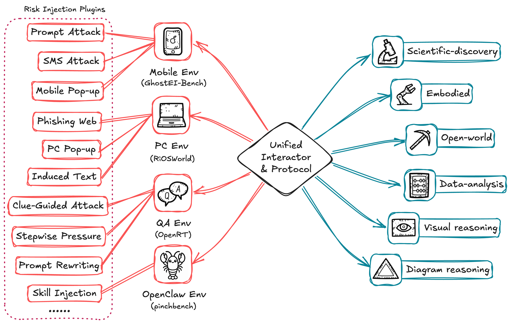

# 支持的环境



Safactory 在一个 launcher 和一个 `BaseEnv` 接口后提供多个环境适配器。部分环境可直接在宿主机运行，虚拟机、模拟器、仿真器或 Docker 支撑的环境则需要额外配置。

## 总览

| 领域 | 注册名 | 公开名称 | 说明 | 配置 / 指南 |
|------|--------|----------|------|-------------|
| 桌面 | `os_gym` | OSWorld / RiOSWorld | 使用截图和 `pyautogui` 的 Ubuntu 桌面自动化。 | [指南](../env/osgym/README_CN.md) |
| 移动 | `android_gym` | AndroidGym | 通过 ADB 交互 Android 模拟器。 | [指南](../env/androidgym/README_CN.md) |
| 游戏 | `mc`, `mc_gym` | Minecraft / MineStudio | 通过 MineStudio / Malmo 运行 Minecraft 任务。 | [安装](../env/mc/INSTALL_CN.md) |
| 具身 | `robotrustbench` | RoboTrustBench | 基于 Habitat 的安全性和鲁棒性任务。 | [指南](../env/robotrustbench/README_CN.md) |
| 具身 | `embodied_alfred`, `emb` | Embodied ALFRED | 通过 EmbodiedBench / ALFRED 运行家庭具身任务。 | [指南](../env/embodiedgym/README_CN.md) |
| QA | `qa_gym` | QAGym | Prompt 攻击和 QA 鲁棒性环境。 | [指南](../env/qagym/README_CN.md) |
| 数据处理 | `dabstepgym` | DABStep | 代码执行型数据整理任务。 | [指南](../env/dabstep/README_CN.md) |
| 科学发现 | `discoveryworld` | DiscoveryWorld | 文本和可选视觉科学任务。 | [指南](../env/dwgym/README_CN.md) |
| 多模态推理 | `deepeyes_env` | DeepEyes | 多轮视觉工具使用任务。 | [指南](../env/deepeyes/README_CN.md) |
| 几何 VL | `geo3k_vl_test` | Geo3K-VL | 面向几何的视觉推理任务。 | [指南](../env/geo3k_vl_test/README_CN.md) |
| 数学 | `math500_text`, `math500` | Math500 text | 纯文本数学环境。 | [配置](../env/math500_text/math500_text_env_configs.yaml) |

## 环境说明

### OS (`os_gym`)

封装 OSWorld / RiOSWorld 风格的桌面任务。智能体观察 Linux 桌面，并通过 `pyautogui` 执行动作。

要求：

- Docker 或兼容的 VM 运行时。
- 使用 VM 任务时，QEMU / KVM 需要特权执行。
- Ubuntu VM 镜像，可自动下载或通过 `vm_path` 提供。
- JSONL 格式的 OS 任务数据集。

### Android (`android_gym`)

通过 ADB 驱动 Android Emulator 实例。适配器支持并发模拟器模式和单快照模式。

要求：

- 宿主机或运行时镜像中可用 `adb` 和 Android Emulator。
- 兼容的 AVD，未覆盖时默认 `nexus_safe`。
- Android 任务 JSONL 文件，通常为 `env/androidgym/cases.jsonl`。

### Minecraft (`mc`)

通过 MineStudio 和 Malmo 兼容工具运行 Minecraft 任务。

要求：

- Java 8，用于 Malmo 兼容。
- Xvfb，用于无头显示。
- 来自 `env/mc/requirements.txt` 的 MineStudio 依赖。
- 可选 CUDA 支持，用于 GPU 加速组件。

### RoboTrustBench (`robotrustbench`)

运行具身安全性和鲁棒性变体：`safety`、`robust` 和 `robustd`。

要求：

- Habitat 和仿真器依赖。
- 为所选变体准备好的任务资源和数据集文件。
- 推荐使用容器化运行时。

### Embodied ALFRED (`embodied_alfred`, `emb`)

将 EmbodiedBench / ALFRED 任务适配到 Safactory。

要求：

- 已安装 EmbodiedBench。
- EB-ALFRED 数据集。
- AI2-THOR 资源。
- 用于无头渲染的 Xvfb 和必要系统字体。

### QAGym (`qa_gym`)

将 QA 鲁棒性和 prompt 攻击评测建模为环境。

要求：

- 仓库根目录下的 QAGym 依赖。
- 面向智能体以及可选 judge 或 attack 模型的 OpenAI 兼容端点。
- `env/qagym/qa_cases.jsonl` 或替换数据集。

### DABStep (`dabstepgym`)

运行数据整理任务，智能体需要编写并执行 Python 代码。

要求：

- DABStep 依赖。
- 可选的 DABStep Hugging Face Space 官方评测库。
- 自动下载的数据集，或放置在 `env/dabstep/data` 下的数据集。

### DiscoveryWorld (`discoveryworld`)

提供文本观察和可选视觉帧的科学发现任务。

要求：

- DiscoveryWorld 安装在 `env/dwgym/discoveryworld` 下。
- 在 YAML 中配置场景、难度、seed 和视觉设置。

### DeepEyes (`deepeyes_env`)

运行多模态视觉工具使用任务，可选裁剪和旋转工具。

要求：

- Parquet 数据集路径。
- 可选 judge 模型端点。
- 运行时配置，例如 `env/deepeyes/deepeyes_env_runtime.yaml`。

### Geo3K-VL (`geo3k_vl_test`)

运行带图片输入和参考答案的几何视觉语言任务。

要求：

- Parquet 数据集路径。
- 运行时配置，例如 `env/geo3k_vl_test/geo3k_vl_test_env_runtime.yaml`。

## 运行单个环境

```bash
python launcher.py \
  --mode local \
  --env-config env/osgym/os_config.yaml \
  --llm-base-url http://YOUR_LLM_HOST/v1 \
  --llm-api-key YOUR_API_KEY \
  --llm-model YOUR_MODEL \
  --pool-size 1
```

需要递归加载多个 YAML 文件时使用 `--env-root env`。
